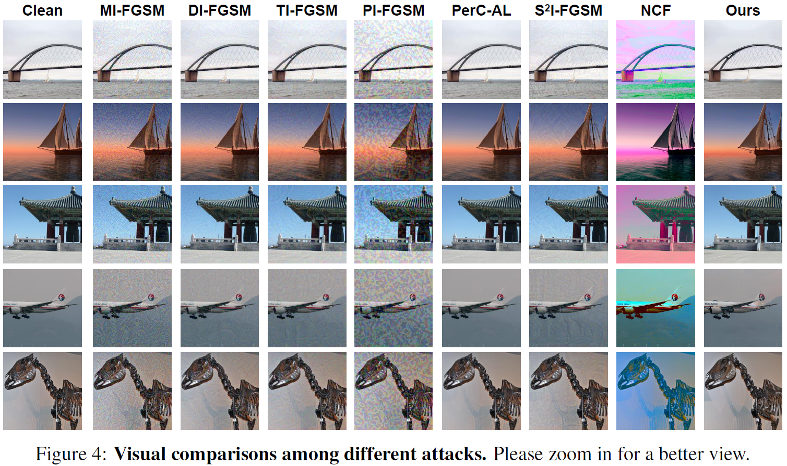
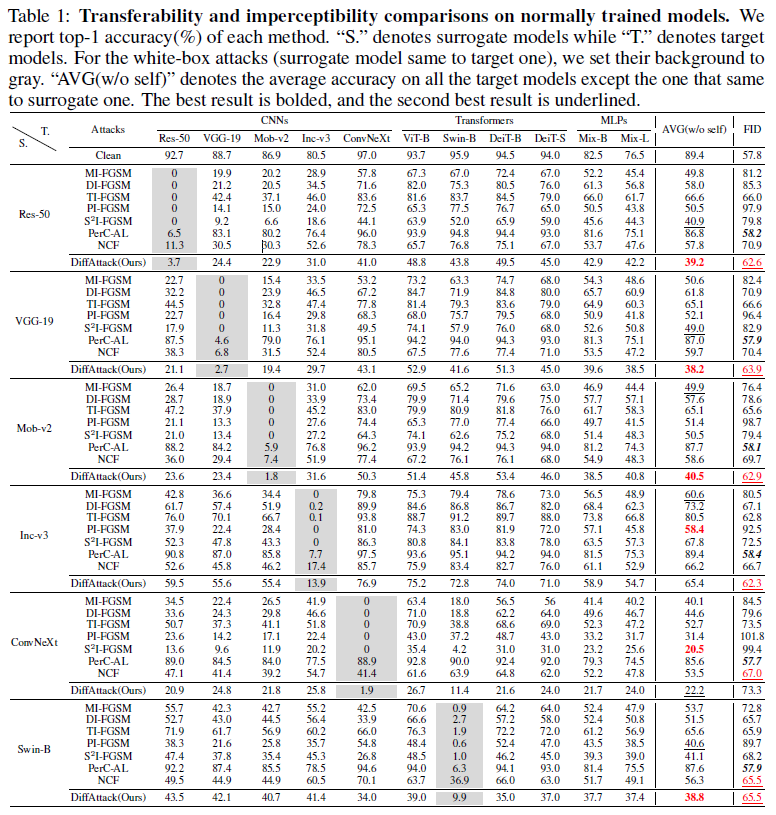
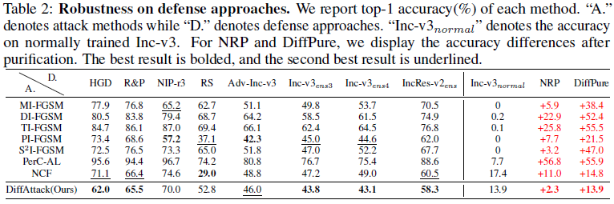

# Diffusion Models for Transferable and Unrestricted Adversarial Attack


[](#License)

## Share us a :star: if this repo does help

This repository is the official implementation of:

<font size=4>[Diffusion Models for Transferable and Unrestricted Adversarial Attack]()</font>

**[Jianqi Chen](https://windvchen.github.io/), [Hao Chen](https://scholar.google.com.hk/citations?hl=en&user=BEDNoZIAAAAJ&view_op=list_works&sortby=pubdate), [Keyan Chen](https://scholar.google.com.hk/citations?hl=en&user=5RF4ia8AAAAJ), [Yilan Zhang](https://scholar.google.com.hk/citations?user=wZ4M4ecAAAAJ&hl=en&oi=ao), [Zhengxia Zou](https://scholar.google.com.hk/citations?hl=en&user=DzwoyZsAAAAJ), and [Zhenwei Shi*](https://scholar.google.com.hk/citations?hl=en&user=kNhFWQIAAAAJ)**

If you encounter any question, please feel free to contact us. You can create an issue or just send email to me windvchen@gmail.com. Also welcome for any idea exchange and discussion.

## Updates

***04/30/2023***

Code cleanup done. Waiting to be made public.


## Table of Contents

- [Abstract](#Abstract)
- [Requirements](#Requirements)
- [Crafting Adversarial Examples](#Crafting-Adversarial-Examples)
- [Evaluation](#Evaluation)
  - [Robustness on other normally trained models](#robustness-on-other-normally-trained-models)
  - [Robustness on defensive approaches](#Robustness-on-defensive-approaches)
- [Results](#Results)
- [Citation & Acknowledgments](#Citation-&-Acknowledgments)
- [License](#License)


## Abstract


Many existing adversarial attacks generate $L_p$-norm perturbations on image RGB space. Although some achievements are gained on transferability and attack success rate, the crafted adversarial examples are easily perceived by human eyes. To tackle with that, some recent works explored unrestricted attacks which are human-insensitive despite large $L_p$-norm values. Following this line, we propose a much powerful unrestricted attack based on diffusion models. Specifically, instead of direct manipulation in pixel space, we craft perturbations in latent space of diffusion models. We further exploit the properties of diffusion models that they can be approximated as strong surrogate recognition models and that they tend to generate natural perturbations embedded with many semantic cues. With specific designs to "deceive" diffusion models and preserve content structure, our proposed method, \emph{DiffAttack}, achieves both good imperceptibility and transferability. To our knowledge, \emph{DiffAttack} is the first method that introduce diffusion models into adversarial attack field. Extensive experiments on various model structures (including CNNs, Transformers, MLPs) and various defense methods have demonstrated our superiority over other attack methods.

## Requirements

1. Hardware Requirements
    - GPU: 1x high-end NVIDIA GPU with at least 16GB memory

2. Software Requirements
    - Python: 3.8
    - CUDA: 11.3
    - cuDNN: 8.4.1

   To install other requirements:

   ```
   pip install -r requirements.txt
   ```

3. Datasets
   - There have been demo-datasets in [demo](demo), you can directly run the optimization code below to see the results.
   - If you want to test the full `ImageNet-Compatible` dataset, please download the dataset [here]() and then change the settings of `images_root` and `label_path` in [main.py](main.py)

4. Pre-trained Models
   - We adopt `Stable Diffusion 2.0` as our diffusion model, you can load the pretrained weight by setting `pretrained_diffusion_path="stabilityai/stable-diffusion-2-base"` in [main.py](main.py).
   - For the pretrained weights of the adversarially trained models (Adv-Inc-v3, Inc-v3$_{ens3}$, Inc-v3$_{ens4}$, IncRes-v2$_{ens}$) in Section 4.2.2 of our paper, you can download them from [here](https://github.com/ylhz/tf_to_pytorch_model) and then place them into the directory `pretrained_models`.

## Crafting Adversarial Examples

To craft adversarial examples, run this command:

```
python main.py --model_name <surrogate model> --save_dir <save path> --images_root <clean images' path> --label_path <clean images' label.txt>
```
The specific surrogate models we support can be found in `model_selection` function in [other_attacks](other_attacks.py).

The results will be saved in the directory `<save path>`, including adversarial examples, perturbations, before/after cross attention, self attention, original images, and logs.

## Evaluation

### Robustness on other normally trained models

To evaluate the crafted adversarial examples on other black-box models, run:

```
python main.py --is_test True --save_dir <save path> --images_root <outputs' path> --label_path <clean images' label.txt>
```
The `save_dir` here denotes the path to save only logs. The `images_root` here should be set to the path of `save_dir` in above [Crafting Adversarial Examples](#crafting-adversarial-examples).


### Robustness on defensive approaches

Apart from the adversarially trained models, we also evaluate our attack's power to deceive other defensive approaches as displayed in Section 4.2.2 in our paper, their implementations are as follows:
- Adversarially trained models (Adv-Inc-v3, Inc-v3$_{ens3}$, Inc-v3$_{ens4}$, IncRes-v2$_{ens}$): Run the code in [Robustness on other normally trained models](#robustness-on-other-normally-trained-models).
- [HGD](https://github.com/lfz/Guided-Denoise): Change the input size to 224, and then directly run the original code.
- [R&P](https://github.com/cihangxie/NIPS2017_adv_challenge_defense): Since our target size is 224, we reset the image scale augmentation proportionally (232~248). Then run the original code.
- [NIPS-r3](https://github.com/anlthms/nips-2017/tree/master/mmd): Since its ensembled models failed to process inputs with 224 size, we run its original code that resized the inputs to 299 size.
- [RS](https://github.com/locuslab/smoothing): Change the input size to 224 and set sigma=0.25, skip=1, max=-1, N0=100, N=100, alpha=0.001, then run the original code.
- [NRP](https://github.com/Muzammal-Naseer/NRP): Change the input size to 224 and set purifier=NRP, dynamic=True, then run the original code.
- [DiffPure](https://github.com/NVlabs/DiffPure): Modify the original codes to evaluate the existing adversarial examples, not crafted examples again

## Results






## Citation & Acknowledgments
If you find this paper useful in your research, please consider citing:
```

```

Also thanks for the open source code of [Prompt-to-Prompt](https://github.com/google/prompt-to-prompt). Some of our codes are based on them.

## License
This project is licensed under the Apache-2.0 license. See [LICENSE](LICENSE) for details.